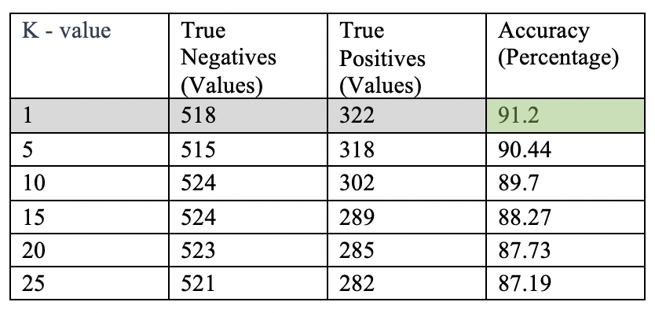

```{r setup, include=FALSE}
knitr::opts_chunk$set(echo = TRUE)
```

## Introduction
This report focuses on analysis of Real time and Multivariate Dataset. It depicts the Analysis of Spam base Dataset. The model prediction in was accomplished using K-Nearest Neighbors Algorithm.

##### K-Nearest Neighbors Algorithm:
Nearest Neighbor analysis, or Nearest Neighbor search, is an algorithm for classifying n-dimensional objects based on their similarity to other n- dimensional objects (Parsian, 2015). The performance of algorithm solely depends on the choice of k as well as distance metrics used to determine it.

## Dataset Description:
This Dataset focuses on classifying Email as Spam or Non-Spam by frequency of word or character. The dataset was developed at Hewlett-Packard Labs and was donated by George Forman on July 1999 (Mark Hopkins, Erik Reeber, George Forman, Jaap Suermondt, 1999). The dataset contains 4601 instances and 58 variables. It contains two fields “Spam” and “Not Spam” for prediction. It is multivariate, real dataset mainly used for classification of attributes.

##### Attributes Information:
Out of 58 variables, 48 attributes are continuous, real and determines the frequency of words like “data”, “telnet”, “technology”, “1999” and many more, 6 attributes are continuous and real and characters like “;”, “(”, “[“ and so on, 1 is continuous and real attribute named “capital_run_length_longest” which determines length of longest uninterrupted sequence of capital letters, 1 continuous and integer attribute named capital_run_length_total which determines sum of length of uninterrupted sequences of capital letters and last attribute is Class which determines whether it is spam or not by 0 and 1.

```{r}
#Session Information
sessionInfo()
```

## Step 1: Collecting Data
```{r}
#Downloading Dataset
if(!file.exists("Data/spambase.zip")) {
        download.file(url = "http://archive.ics.uci.edu/ml/machine-learning-databases/spambase/spambase.zip",
                      destfile = "Data/spambase.zip")
        
        unzip("Data/spambase.zip", exdir = "Data/")
}
```

```{r, include=FALSE}
if(!require(readr)) install.packages("readr")
if(!require(dplyr)) install.packages("dplyr")
if(!require(tidyr)) install.packages("tidyr")
if(!require(base)) install.packages("base")
if(!require(class)) install.packages("class")
if(!require(gmodels)) install.packages("gmodels")
if(!require(png)) install.packages("png")
```

```{r, echo=TRUE}
#Reading Data
#Data File
data_raw <- read.csv("Data/spambase.data", header = F)

#Names File
library(readr)
data_raw_names <- read.delim("Data/spambase.names", header = FALSE)
data_raw_names <- data_raw_names[-(1:30),]
data_raw_names <- as.data.frame(data_raw_names)

library(dplyr)
library(tidyr)
data_raw_names <- data_raw_names %>%
        separate(data_raw_names, c("Variable", "Type"), sep = ":")

#Assigning Name to Dataset
names(data_raw) <- data_raw_names$Variable
names(data_raw)[is.na(names(data_raw))] <- "classes"
```

## Step 2 - Exploring and Preparing Data
As a part of Exploratory Data Analysis, I found that there are no missing values in the dataset. 
```{r, include=TRUE}
data <- data_raw

#Checking for missing values
any(is.na(data))
```

I renamed the levels “0” as “Not Spam” and “1” as “Spam” of class column of dataset observed that there are 1813 mails which are spam out of 4601 mails which is approx. 39.4%.
```{r}
#Converting Classes to factors
data$classes <- as.factor(data$classes)
levels(data$classes)

#Renaming levels of Diagnosis Column
data$classes <- recode(data$classes,
                         "0" = "Not Spam",
                         "1" = "Spam")
levels(data$classes)

#Total Number of Benign and Malignant
summary(data$classes)

#Percentage of Benign and Malignant
round(prop.table(table(data$classes))*100, 2)

```

As the data is unevenly distributed, the data was normalized using following function so that all the numeric values lies between 0 to 1
```{r}
#Normalizing Function
normalize <- function(x) {
        return( (x - min(x)) / (max(x) - min(x)))
}
NormalizeData <- as.data.frame(lapply(data[1:57], normalize))

#Summary of make word frequency
summary(data$word_freq_make)

#Summary of Normalized Data make word frequency
summary(NormalizeData$word_freq_make)

#Cleaning Data
CleanData <- cbind(data[, 58], NormalizeData)
names(CleanData)[names(CleanData) == "data[, 58]"] <- "class"
CleanData$class <- as.character(CleanData$class)
```

To predict the model using K – Nearest Neighbors Algorithm, I split the 80% Data into Training Dataset and 20% Data into Testing Dataset.

```{r}
##### Splitting the Data into Train and Test Datasets #####
set.seed(1234)
samp <- sample(nrow(CleanData),0.80*nrow(CleanData))
TrainData <- CleanData[samp,]
TestData <- CleanData[-samp,]

TrainLabels <- TrainData[, 1]
TestLabels <- TestData[, 1]
```

## Step 3 - Training a Model
```{r}
#KNN Algorithm
library(class)
TestPredict <- knn(train = TrainData[, 2:58], 
                   test = TestData[, 2:58],
                   cl = TrainLabels, k = 1)
```

## Step 4 - Evaluating Model Performance
```{r}
library(gmodels)
CrossTable(x = TestLabels, 
           y = TestPredict,
           prop.chisq = FALSE)
```

##### Performance Table for different values of K
```{r}
library(png)
 

```

So, from the table it is observed that Highest Accuracy is 91.2% and is achieved by k value 1.

## Step 5 - Improving Model Performance
Z - Transformation is one way for improving performance of model. 
```{r}
# Z - score Transformation
ZScoreData <- as.data.frame(scale(data[-58]))
summary(ZScoreData$word_freq_make)

#Updated Data
UpdateData <- cbind(data[, 58], ZScoreData)
names(UpdateData)[names(UpdateData) == "data[, 58]"] <- "class"
UpdateData$class <- as.character(UpdateData$class)

set.seed(1234)
samp1 <- sample(nrow(UpdateData),0.80*nrow(UpdateData))
TrainData1 <- UpdateData[samp1,]
TestData1 <- UpdateData[-samp1,]

TrainLabels1 <- TrainData[, 1]
TestLabels1 <- TestData[, 1]

library(class)
TestPredict1 <- knn(train = TrainData1[, 2:31], 
                    test = TestData1[, 2:31],
                    cl = TrainLabels1, k = 1)

library(gmodels)
CrossTable(x = TestLabels1, 
           y = TestPredict1,
           prop.chisq = FALSE)

library(png)

```

From the table we can observe that with Z - Score Transformation, the maximum accuracy achieved is 90.01%.

## Summary
1) Unlike many classification algorithms, KNN does not do any learning. It simply stores the training data verbatim.
2) Unlabeled test examples are then matched to the most similar records in the training set using a distance function, and the unlabeled example is assigned the label of its neighbors.
3) In Email SpamBase Data Set, the model trained on Normalized Data is more accurate then the model trained on Z-Score Data.

## References
1) Mark Hopkins, Erik Reeber, George Forman, Jaap Suermondt. (1999, July 01). Spambase Data Set. Retrieved from UCI Machine Learning Repository: http://archive.ics.uci.edu/ml/datasets/Spambase
2) Parsian, M. (2015). Data Algorithms. Sebastopol, CA: O’Reilly Media, Inc.
3) Lantz, B. (2013). Chapter 3: Lazy Learning – Classification Using Nearest Neighbors. In B. Lantz, Machine Learning with R (pp. 76 - 87). Birmingham B3 2PB, UK.: Packt Publishing Ltd.

